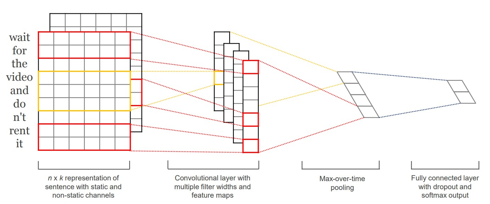
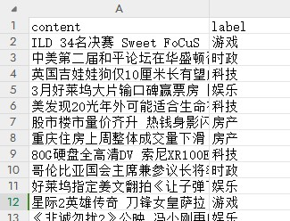

# TextCNN在pytorch中的实现
Text classification implementation based on TextCNN and transformers.BertTokenizer. Includes training, prediction, data loading, and accuracy evaluation.

## Overview of the TextCNN
Structure of TextCNN:
<p align="center"></p>

## 相关模型仓库
（1）在./bert-base-chinese下载BERT分词器模型（必要）
[pytorch.bin](https://huggingface.co/bert-base-chinese/resolve/main/pytorch_model.bin)

（2）下载本项目提供的训练模型（可选）
本项目提供训练好的模型文件，可供项目直接实现预测分类。
点击链接[textcnn_model.pth](https://drive.google.com/file/d/1JBvAetA08j-8ojwvhlpY8udMp8Fz_jo-/view?usp=drive_link)
下载预测分类模型。

## 准备工作
（1）训练集、验证集样例：
<p align="center"></p>

（2）训练集、验证集格式：
<p align="center"></p>

（3）根据实际数据集映射标签设置
```
# 标签映射字典
label_map = {
    0: '体育',
    1: '财经',
    2: '房产',
    3: '家居',
    4: '教育',
    5: '科技',
    6: '时尚',
    7: '时政',
    8: '游戏',
    9: '娱乐'
}
```
## 项目调参config.py
在文本分类任务中，超参数的选择对模型性能有显著影响。以下是本项目中使用的主要超参数：
```
vocab_size：词汇表的大小。

embed_size：词嵌入的维度。

num_classes：分类的类别数量。

kernel_sizes：卷积核的大小列表。

num_channels：每个卷积核的数量（输出通道数）。

dropout：dropout 概率。

batch_size：每批次处理的样本数量。

lr：学习率。

num_epochs：训练的迭代次数。

num_workers：数据加载时的线程数量。
```

## 预测与评估
（1）预测
在dataset文件夹中放置需要预测的测试集data_test.csv，获得label预测列。

（2）评估
从data_validation.csv中获取每一类新闻的分类精度。

***********
## Please Cite This Work~

```
@NeoTse0622
Update time:2024/7/16
URL:https://github.com/NeoTse0622
CSDN:https://blog.csdn.net/qq_45193872?spm=1018.2226.3001.5343
```
